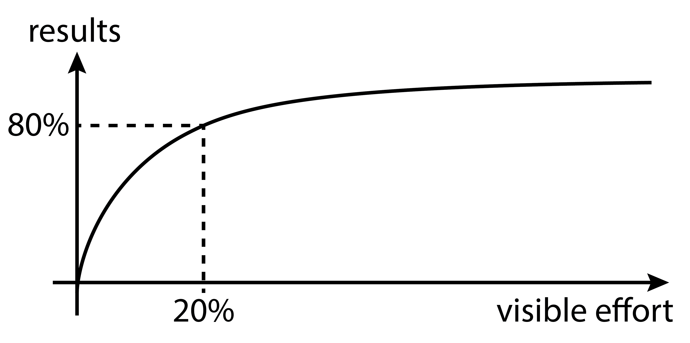

# slides are available online!

- html notes: [ericmjl.github.io/art-of-effective-scientific-communication][html]
- source: [github.com/ericmjl/art-of-effective-scientific-communication][source]

[source]: https://github.com/ericmjl/art-of-effective-scientific-communication
[html]: https://ericmjl.github.io/art-of-effective-scientific-communication

# about myself

- [UBC Vancouver][UBC], [Integrated Sciences][ISCI]
- [MIT][MIT], [Biological Engineering][MITBE]

[UBC]: http://www.ubc.ca/
[MIT]: http://web.mit.edu/
[MITBE]: https://be.mit.edu/
[ISCI]: https://intsci.ubc.ca/

# why this talk?

- Your future will involve communication at many levels of technical difficulty.
- Let me share with you a taste of what that will look like.

# main ideas

1. Communicate your idea as simply as possible, but no simpler than necessary.
1. Find a safe space and time to develop your thoughts.
1. Strategically select colleagues to help give you feedback.
1. Multiple rounds of rewriting is inevitable.

# simplicity

## temptation

- You've done a ton of work.
- You want to include everything.
- *这样才能对得起自己的付出，对吧？*

## reality

- Your audience won't necessarily have enough **background**.
- Your reviewers may not have enough **time**.
- Nobody but you knows best the **details** of what you've done.

## the artful principle

How do I phrase my idea, such that:

- it and nothing more is sufficient for my audience to know what I'm saying
- it and nothing less is necessary for my audience to know what I'm saying?

*Who is my audience, and how do I know what they know?*

## before

{#figures .class}

## after

{#fig1 .class}

## word diet

- before: 2794 words in main text.
- after: 1847 words in main text.

## what happened?

# space & time

## spaces

I found spaces where I could write and think in isolation.

Yet, there were other people doing work in those same spaces.

## time

My advisor let me set the tempo, and I repaid the trust with regular updates.

## details matter

Take charge, experiment, and design your environment to fit your needs.

## core idea

- Take initiative.
- Toy with your idea, formulate it, find its limits.
- Develop confidence to explain it.

# feedback

## advisor

**"Does it make sense to my advisor?"**

- Advisor is responsible for packaging your story into research group's overall scientific direction.

## colleagues

**"Does it make sense to my colleagues?"**

- Colleagues are a good starting point, but should not be the only people you talk with.

## communications lab

**"Does it make sense to a specialist outsider?"**

- A specialist who shares your foundational knowledge should understand the general implications of your research.

## your mom

*Don't bother.*

# rounds and rounds of editing

## fundamentals matter

- Command of English grammar and specialized vocabulary.
- Imitate papers written by native English writers.

## let it go

- First drafts are always going to be unsatisfactory.

## each round gets better

- "Show me your first draft and I'll show you where you're wrong."
- Each rewrite clarifies the scientific idea further.

# summary

## go simple

{#simplicity .class height=300px}

## the artful pareto

{#pareto .class height=300}

## build your community

{#community .class height=300px}

## keep iterating

{#upward-spiral .class height=300px}

# contact

- [Personal website](http://www.ericmjl.com)
- [Contact](http://www.shortwhale.com/ericmjl)
- [GitHub](https://github.com/ericmjl)

# resources

1. [Some modest advice for graduate students][advice]
1. [Elements of Style][elements]
1. [How to write a scientific paper][howto]

[advice]: http://stearnslab.yale.edu/some-modest-advice-graduate-students
[elements]: https://en.wikipedia.org/wiki/The_Elements_of_Style
[howto]: http://bitesizebio.com/10837/book-review-how-to-write-and-publish-a-scientific-paper-by-robert-a-day-and-barbara-gastel/
